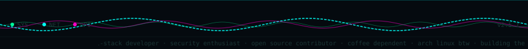

<!-- ╔══════════════════════════════════════════════════════════════════════╗ -->
<!-- ║  ZENITH.SYS — GitHub Profile README                                 ║ -->
<!-- ║  All SVG assets are auto-generated. See /scripts/ to regenerate.    ║ -->
<!-- ║  Contribution heatmap refreshes daily via GitHub Actions.           ║ -->
<!-- ╚══════════════════════════════════════════════════════════════════════╝ -->

<!-- ░░░ HEADER ░░░ -->

 

<!-- ░░░ SECTION: IDENTITY ░░░ -->
<h3><code>Varaaa-arch@github ~ $ cat identity.txt</code></h3>

<table>
<tr>
<td valign="top">

</td>
<td valign="top">

</td>
</tr>
</table>

 

<!-- ░░░ SECTION: FEATURED PROJECTS ░░░ -->
<h3><code>Varaaa-arch@github ~ $ ls ./projects/</code></h3>

 

<!-- ░░░ SECTION: CONTRIBUTIONS ░░░ -->
<h3><code>Varaaa-arch@github ~ $ ./contributions --neon-graph</code></h3>

 

<!-- ░░░ SECTION: TECH STACK ░░░ -->
<h3><code>Varaaa-arch@github ~ $ cat /etc/tech-stack</code></h3>

<!-- Languages -->

  
  
  
  

<!-- Frontend -->

  
  
  

<!-- Backend / Infra -->

  
  
  
  

<!-- OS / Tools -->

  
  
  
  

 

<!-- ░░░ SECTION: LINKS ░░░ -->
<h3><code>Varaaa-arch@github ~ $ ./links.sh</code></h3>

  
  
  
  

 

<!-- ░░░ FOOTER ░░░ -->

 

 
<code>// built with caffeine, curiosity, and way too many open tabs</code>

